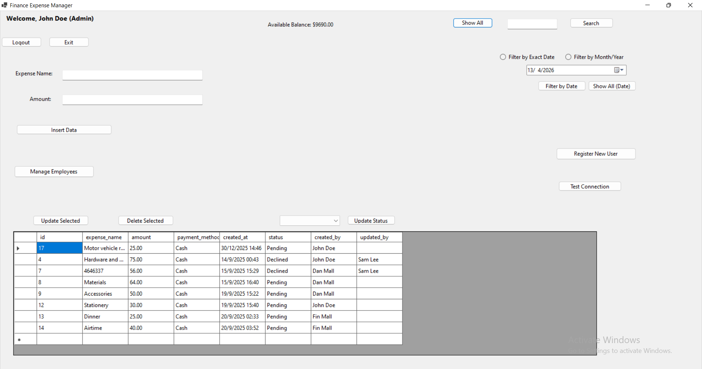
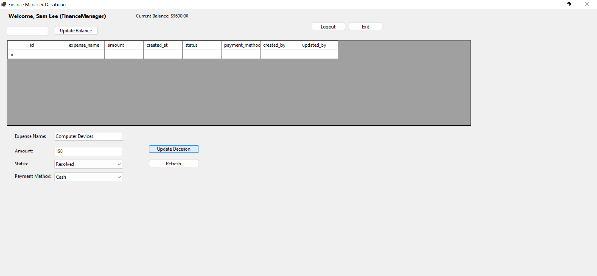

# 💰 Finance Management System

##  Overview
The Finance Management System is a desktop-based application developed using C# and Windows Forms (.NET Framework). It is designed to help users manage financial transactions, track expenses, and maintain financial records efficiently.

---

##  Features
- Add and manage financial transactions
- Track income and expenses
- View financial summaries
- User-friendly interface
- Desktop-based system

---

## 🛠️ Technologies Used

### 🔹 Programming Language
- C#

### 🔹 Framework
- Windows Forms (.NET Framework)

### 🔹 Development Tool
- Microsoft Visual Studio

---

## 📂 Project Structure
Finance-Management-System/
│
├── FinanceApp.sln
├── FinanceApp/
│ ├── Program.cs
│ ├── AdminExpensesForm.cs
│ ├── AdminExpensesForm.Designer.cs
│ ├── App.config
│ └── ...
│
├── installer/
│ ├── setup.exe
│ └── setup.msi
│
└── README.md

---

## ⚙️ How to Run the Project

### 🔹 Option 1: Run from Visual Studio
1. Open the `.sln` file in Visual Studio  
2. Build the project  
3. Click **Start** to run  

---

### 🔹 Option 2: Run Executable
1. Navigate to:

installer/

2. Run:

setup.exe

---

## 📸 Screenshots

### 🔹 Finance Expense Manager Workspace

### 🔹 Fiance Manager Dashboard

---

## 🎯 Future Improvements
- Add database integration (SQL Server)
- Generate financial reports
- Improve UI/UX design

---

## 👨‍💻 Author
**Tawanda Satiyi**

---

## 📬 Contact
- GitHub: https://github.com/tawazgman5-eng
